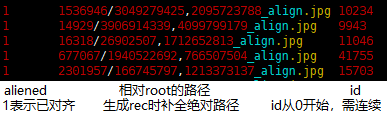

# 加入角度信息的InsightFace

用insightface实现商汤[DREAM](https://github.com/penincillin/DREAM/)  

## 数据处理  
1.用mxnet_tools/im2rec_1root2label.py 生成lst  
2.用src/data/face2rec_angle.py 生成带角度信息的rec文件  
###### 执行：
    python im2rec_1root2label.py prefix root --list --reccursive
    python face2rec_angle.py prefix.lst  --num-thread 28
###### list格式如下，中间以tab作为分隔符  
  

## 训练  